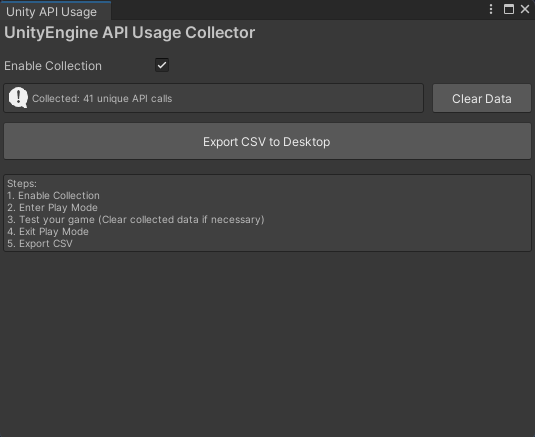

# Unity API Usage Collector

一个基于 Harmony 的 团结引擎 API 调用统计工具，能够在运行时自动统计项目中所有 UnityEngine API 的使用情况。

## 功能特性

- **源码0侵入**：无需修改任何源代码，使用 Harmony 库在运行时动态插入统计代码，自动统计所有 UnityEngine API 调用。退出 Play 模式后自动恢复，不影响正式构建
- **一键导出报告**：通过Editor菜单一键导出为CSV表格，按调用次数排序，方便分析和优化

## 快速开始

### 安装步骤

1. 将 `Plugins` 和 `UnityApiUsageCollector` 文件夹拷贝到目标项目的 `Assets` 目录下

### 使用步骤

1. **打开工具窗口**：在团结引擎Editor菜单中选择 `Tools → API Usage Collector`；

2. **启用统计功能**：勾选 "Enable Collection" ；

3. **进入 Play Mode**：点击 Play 按钮，工具会自动开始统计；

4. **测试你的游戏**：运行需要分析的游戏功能，所有 UnityEngine API 调用会被自动记录。如需清除本次Play Mode已收集的数据，点击Clear Data；

5. **退出 Play Mode**：停止游戏，控制台会显示统计结果摘要；

6. **导出统计报告**：点击 "Export CSV to Desktop" 按钮，CSV 文件会保存到桌面，文件名为 `unity_api_usage.csv`。

## 界面预览

## 技术原理

### Harmony Transpiler

本工具使用 Harmony 的 **Transpiler** 功能，在 IL 指令级别注入统计代码：

1. 扫描项目中所有用户脚本（Assembly-CSharp）
2. 对每个方法应用 Transpiler，分析 IL 指令
3. 检测所有 UnityEngine API 调用（Call/Callvirt 指令）
4. 在调用后自动插入统计代码
5. 运行时收集 API 调用数据